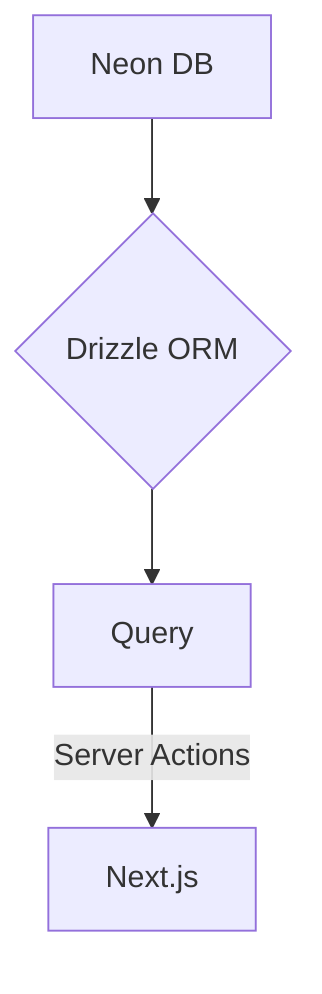

## 项目介绍

这是一个基于 Next.js 16 的博客项目，使用了 Drizzle ORM 进行数据库操作，并集成了 TypeScript、Tailwind CSS 等技术栈。该项目旨在提供一个简单易用的博客平台，支持文章的创建、编辑、删除以及统计功能。

## 技术栈

- **Next.js 16**: 用于构建前端应用，支持服务器端渲染和静态生成。
- **TypeScript 7**: 提供类型安全的开发体验。
- **Heroui**: 用于构建现代化的用户界面组件。
- **Tailwind CSS**: 用于提供原子化的 CSS 样式，快速构建响应式界面。
- **Drizzle ORM**: 用于与数据库进行交互，提供类型安全的查询和操作。
- **Neon PostgreSQL**: 作为数据库存储文章和统计数据。
- **Oxc**: 用于代码检查与格式化。

## 功能特点

- **文章管理**: 支持文章的创建、编辑、删除和查看。
- **统计功能**: 提供文章的阅读量、点赞数等统计信息。
- **响应式设计**: 支持移动端和桌面端的访问。
- **SEO优化**: 使用 Next.js 的内置功能进行 SEO 优化。
- **类型安全**: 使用 TypeScript 和 Drizzle ORM 提供类型安全的开发体验。
- **CI/CD**: 使用 Husky 和 lint-staged 进行代码检查和格式化。

## 项目结构

```
├── app
│   ├── posts
│   │   ├── page.tsx          # 文章列表页面
│   │   └── [slug]
│   │       └── page.tsx      # 文章详情页面
├── server
│   ├── actions
│   │   └── post.ts           # 文章相关的服务端操作
│   ├── db
│   │   ├── schema
│   │   │   └── post.ts       # 数据库表结构定义
│   │   └── query
│   │       └── post.ts       # 数据库查询操作
│   └── index.ts              # 数据库服务入口文件
├── assets                    # 静态资源文件夹
│   └── styles                # 样式文件
│       └── globals.css       # 全局样式文件
├── components                # 自定义组件
├── hooks                     # 自定义 Hook
├── utils                     # 工具函数
├── README.md                 # 项目说明文档
├── AGENTS.md                 # Agents 文件
├── next.config.ts            # Next.js 配置文件
├── tsconfig.json             # TypeScript 配置文件
├── package.json              # 项目依赖配置
├── drizzle.config.ts         # Drizzle ORM 配置文件
├── mdx-components.tsx        # MDX 组件配置文件
├── .oxfmtrc.json             # Oxc 格式化配置文件
├── .oxlintrc.json            # Oxc 检查配置文件
└── postcss.config.js         # PostCSS 配置文件
```

## 安装与运行

1. 克隆项目到本地

```bash
git clone https://github.com/HM-Suiji/blog.git
```

2. 进入项目目录

```bash
cd blog
```

3. 安装依赖

```bash
bun install
```

4. 启动开发服务器

```bash
bun run dev
```

5. 访问 `http://localhost:3000` 查看项目

## 前后端架构

本项目采用前后端分离的架构，前端使用 Next.js 16 构建，后端使用 Drizzle ORM 进行数据库操作。前端和后端通过 Nextjs Server Actions 进行通信(类型安全)，实现了前后端的解耦与安全保障。


