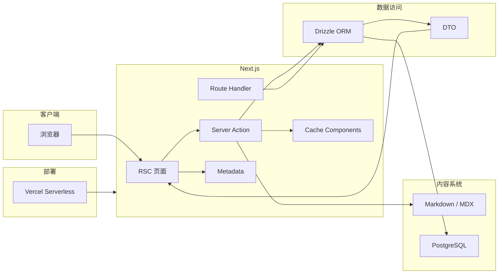

# 探秘穗积宇宙船的核心架构

## 前言

穗积宇宙船（Suiji Tech）是一个基于 Next.js 构建的全栈博客系统。

与传统博客系统不同，我希望它不仅仅是一个内容展示网站，而是一套结合现代 Web 技术理念的内容平台：拥有优秀的阅读体验、完善的 SEO 能力、类型安全的数据层，以及 Serverless 时代下更简单的部署方式。

目前，穗积宇宙船具备以下特点：

- **响应式设计**

  博客针对桌面端、平板端以及移动端进行了适配。无论用户通过什么设备访问，都可以获得一致且舒适的阅读体验。

- **现代化 SEO 方案**

  基于 Next.js 提供的 Metadata API、静态生成（SSG）以及增量静态生成（ISR）能力，让页面能够被搜索引擎高效抓取，同时保持良好的访问性能。

- **灵活的内容管理**

  文章内容采用 Markdown / MDX 编写，通过文件系统管理内容，同时结合数据库保存结构化数据，让内容创作和业务数据保持解耦。

- **Serverless 架构**

  项目部署于 Vercel 平台，利用 Serverless Function 和边缘网络能力，无需维护传统服务器，将更多精力集中在功能开发和内容创作上。

## 核心架构



穗积宇宙船基于 Next.js App Router 构建，充分利用 React Server Components 提供的 Client / Server 分层能力，将应用划分为数据层、业务层以及展示层。

虽然 Next.js 并不是传统意义上的 MVC 框架，但通过合理的工程组织，可以实现类似 MVC 的职责分离。

### Model 层：类型安全的数据访问

在数据层，我选择了 **Drizzle ORM** 作为 PostgreSQL 的 ORM 方案。

相比传统 ORM，Drizzle 更接近 SQL，同时拥有优秀的 TypeScript 类型推导能力。

通过 Drizzle，我可以直接根据 Schema 获得完整类型：

- 数据库结构与 TypeScript 类型保持同步；
- 查询结果自动推导；
- 减少手写 SQL 带来的维护成本。

例如：

```typescript
const posts = await db.select().from(postsTable)
```

返回的数据类型会自动根据数据库 Schema 推导。

不过，数据库实体并不应该直接暴露给前端。

例如：

- 用户密码等敏感字段；
- 数据库内部字段；
- Date 等需要序列化的数据类型。

因此，我引入 DTO（Data Transfer Object）层，对数据进行转换和裁剪。

例如：

```typescript
export type Dtoify<T> = {
  [K in keyof T]: T[K] extends Date
    ? string
    : T[K] extends string | null
      ? string
      : T[K]
}

type UserDTO = Dtoify<Omit<UserEntity, 'password'>>
```

经过 DTO 转换后，前端获得的数据会更加安全，也更加符合展示层需求。

### Controller 层：Server Action 驱动的业务入口

在传统全栈应用中，Controller 通常负责接收 HTTP 请求，再调用 Service 完成业务逻辑。

但在 Next.js App Router 架构中，我没有选择传统 REST API 的方式，而是采用 Server Action 作为服务端业务入口。

相比 API Route，Server Action 有几个优势：

- 不需要额外暴露 HTTP Endpoint；
- 前后端共享 TypeScript 类型；
- 可以直接调用服务端代码；
- 更容易结合 Next.js 的缓存系统。

例如：

```tsx
export async function findPosts() {
  'use cache'

  cacheTag('posts')
  cacheLife('weeks')

  return await getPosts()
}

export default async function PostsPage() {
  const posts = await findPosts()

  return <>...</>
}
```

通过 Server Action，我可以直接在服务端完成数据库查询，并结合 Next.js Cache Components 实现细粒度缓存。

相比传统 RPC 方案，这种方式减少了额外的接口维护成本，同时保持完整的类型安全。

## SEO 优化与 RSS 订阅

作为一个内容型网站，SEO 是博客系统中非常重要的一环。

穗积宇宙船利用 Next.js 提供的 Metadata API，对页面标题、描述、Open Graph 信息等内容进行动态生成。

例如：

```tsx
export async function generateMetadata({
  params,
}: {
  params: { slug: string }
}) {
  const post = await getPost(params.slug)

  return {
    title: post.title,
    description: post.description,
    openGraph: {
      title: post.title,
      description: post.description,
      url: `https://suiji.tech/blog/${params.slug}`,
      images: [...],
    },
  }
}
```

这样，每篇文章都会拥有独立的 SEO 信息，同时也能在社交平台分享时展示正确的预览内容。

### Sitemap

由于博客拥有明确的路由结构，因此我选择在构建阶段生成 sitemap。

使用 `next-sitemap`，项目在 Build 阶段读取完整路由信息，并生成：

```
sitemap.xml
```

相比运行时生成，这种方式更加简单，同时不会产生额外请求开销。

### RSS Feed

RSS 与 Sitemap 不同。

Sitemap 只需要记录页面地址，而 RSS 需要包含文章标题、摘要、发布时间，甚至完整正文。

因此，我没有选择构建阶段生成 RSS，而是通过 Route Handler 动态生成：

```ts
// app/rss.xml/route.ts

export async function GET() {
  const feed = new Feed({
    title: siteConfig.name,
    description: siteConfig.description,
    id: siteConfig.url,
    link: siteConfig.url,
    language: 'zh-CN',
    copyright: siteConfig.copyright,
    updated: new Date(),
    author: {
      name: siteConfig.name,
    },
  })

  const posts = await findPosts()

  // Add posts to feed

  return new Response(feed.rss2(), {
    headers: {
      'Content-Type': 'application/rss+xml; charset=utf-8',
    },
  })
}
```

通过 Route Handler，可以保证 RSS 内容始终与最新文章保持同步。

## 未来展望

穗积宇宙船的目标并不是简单复刻一个博客程序，而是探索一种更加现代化的博客架构：

- Serverless 部署；
- 全 TypeScript 技术栈；
- 类型安全的数据流；
- 文件内容与数据库数据分离；
- 基于 Next.js 的全栈开发模式。

目前，市面上大部分成熟博客系统仍然依赖传统服务器部署，例如 Halo 虽然功能完善，但仍需要维护后端服务。

而 Serverless 架构的博客系统仍然相对较少。

未来，如果能够进一步抽离项目中的硬编码配置，并完善插件化能力，我计划将穗积宇宙船整理为一个开源博客框架，让更多开发者能够快速搭建属于自己的现代化博客。

敬请期待。
