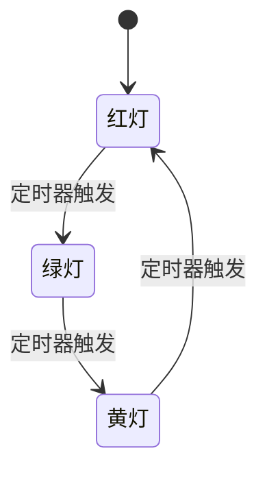
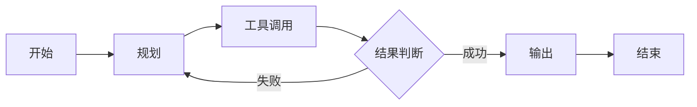
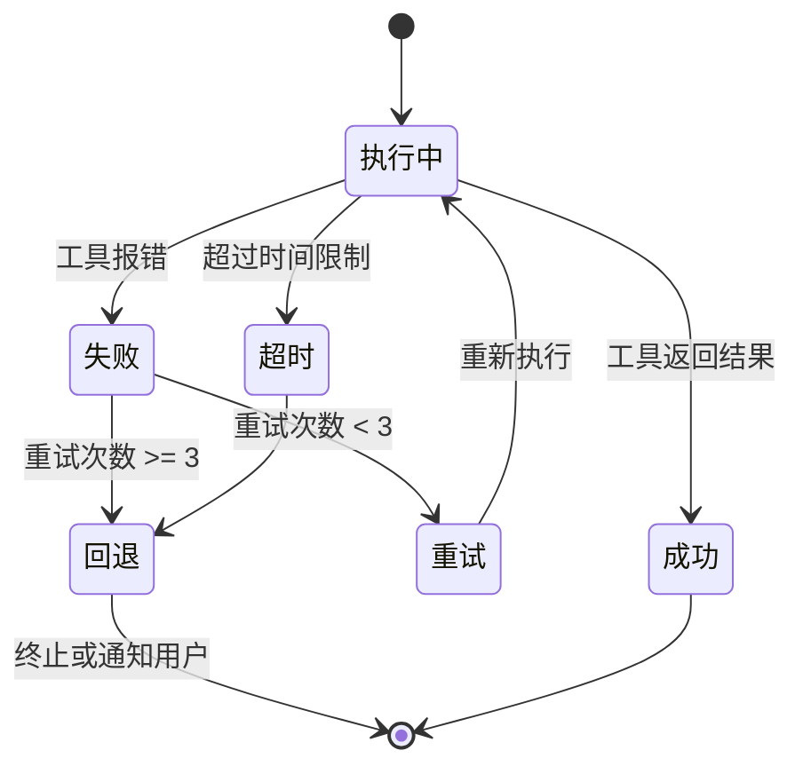
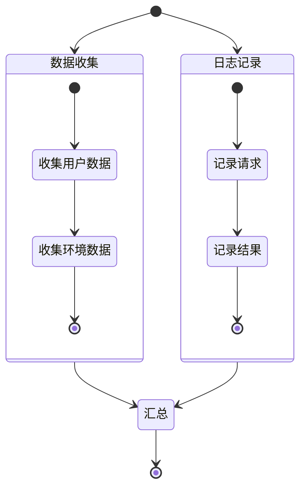

# Graph Agent = 状态机：Agent Workflow 离不开状态机

## 前言

在 AI Agent 领域，我们经常听到一个概念：**Graph Agent**。

很多人把它当作一种新的架构范式，仿佛它是从某个前沿实验室里冒出来的全新思想。

但如果你仔细审视 Graph Agent 的本质，你会发现一个令人惊讶的事实：

> **Graph Agent 就是状态机（State Machine）。**

这不是类比，不是简化，而是本质上它们是同一种东西。

理解这一点，对于设计和实现 Agent Workflow 至关重要。因为状态机是一个拥有数十年历史、经过无数系统验证的成熟理论，而 Agent Workflow 中几乎所有关键问题——流程控制、错误恢复、并发管理、可观测性——状态机早已给出了优雅的答案。

## 什么是状态机

在深入 Agent 之前，让我们先回顾状态机的基本概念。

一个有限状态机（Finite State Machine, FSM）由以下要素组成：

- **状态集合（States）**：系统可以处于的所有可能状态
- **输入/事件（Events）**：触发状态转移的外部信号
- **转移函数（Transition Function）**：给定当前状态和输入，决定下一个状态
- **初始状态（Initial State）**：系统启动时的状态
- **终止状态（Final States）**：可选的结束状态

用一个简单的例子来说明：一个交通信号灯就是一个状态机。



状态机的核心思想是：**任何时刻，系统都处于一个确定的状态；当收到输入时，系统根据转移规则跳转到下一个状态。**

这个模型虽然简单，但它具有极强的表达能力。从编译器的词法分析器，到网络协议的状态管理，再到游戏 AI 的行为控制，状态机无处不在。

## 什么是 Graph Agent

当我们说 Graph Agent 时，我们通常指的是这样一种 Agent 架构：

Agent 的执行流程被建模为一个有向图（Graph），其中：

- **节点（Node）** 代表 Agent 的某个处理步骤或能力单元
- **边（Edge）** 代表步骤之间的执行顺序和条件分支
- **状态（State）** 在节点之间传递，每个节点可以读取、修改或生成新的状态

典型的 Graph Agent 框架（如 LangGraph）会定义这样的结构：



在这个图中：

- 每个节点（Plan、Tool、Output）是一个处理单元
- 边定义了执行流向
- 状态（当前的对话历史、中间结果、错误信息等）在整个图中流动

## 为什么说 Graph Agent = 状态机

让我们将 Graph Agent 与状态机进行严格对比：

| 状态机概念 | Graph Agent 对应                    |
| ---------- | ----------------------------------- |
| 状态集合   | Agent 的所有可能执行阶段            |
| 事件/输入  | LLM 的输出、工具返回值、用户输入    |
| 转移函数   | 路由逻辑（根据 LLM 输出决定下一步） |
| 当前状态   | 当前所在的节点 + 上下文信息         |
| 初始状态   | Agent 的启动节点                    |

**每一个节点就是一个状态，每一次转移就是一次状态跳转。**

这不是牵强的类比，而是精确的等价关系。

当你在 LangGraph 中定义一个图时：

```python
from langgraph.graph import StateGraph

graph = StateGraph(AgentState)
graph.add_node('plan', plan_node)
graph.add_node('execute', execute_node)
graph.add_node('output', output_node)

graph.add_edge('plan', 'execute')
graph.add_conditional_edges('execute', should_continue)
```

你实际上在做的事情，和用 Statechart 或 XState 定义一个状态机完全一样：

```typescript
const agentMachine = createMachine({
  id: 'agent',
  initial: 'plan',
  states: {
    plan: { on: { NEXT: 'execute' } },
    execute: {
      on: {
        SUCCESS: 'output',
        FAILURE: 'plan',
      },
    },
    output: { type: 'final' },
  },
})
```

两者的本质完全一致。

## Agent Workflow 为什么离不开状态机

理解了 Graph Agent 的状态机本质之后，我们来看 Agent Workflow 中几个核心问题，以及状态机如何天然地解决它们。

### 1. 流程的可预测性

Agent 最大的挑战之一是**不可预测性**。

LLM 的输出是概率性的，你无法保证它每次都走同一条路径。

但如果我们将 Agent 建模为状态机，虽然单次执行的路径可能不同，但**所有可能的路径都是预先定义好的**。

这意味着：

- 你可以在运行前分析所有可能的执行路径
- 你可以对特定路径设置超时、重试、熔断等策略
- 你可以在监控面板上清晰地看到 Agent 当前处于哪个状态

状态机给了不确定的 LLM 一个确定的框架。

### 2. 错误恢复

在实际生产中，Agent 经常会遇到各种失败：

- API 调用超时
- 工具返回错误
- LLM 输出格式不正确
- 上下文超出 token 限制

如果没有状态机，错误处理往往是这样的：

```python
try:
    result = llm.call(messages)
    tool_result = tool.execute(result)
except Exception as e:
    # 该怎么办？重试？回退？终止？
    pass
```

而状态机提供了一种结构化的错误处理方式：



每种错误都有明确的状态转移路径，不会出现「不知道该怎么办」的情况。

### 3. 并发与并行

复杂的工作流经常需要并行执行多个任务。

状态机的扩展——状态图（Statechart）——原生支持并行状态：



这意味着 Agent 可以同时执行工具调用和日志记录，而不需要复杂的线程管理代码。

### 4. 可观测性

生产环境中的 Agent 必须是可观测的。

状态机天然提供了：

- **当前状态**：Agent 现在在做什么
- **状态历史**：Agent 经过了哪些步骤
- **转移日志**：每次状态变化的原因和时间戳
- **状态统计**：每个状态的平均停留时间、进入次数

这些信息对于调试和优化 Agent Workflow 价值巨大。

### 5. 恢复与持久化

当 Agent 执行到一半需要暂停（例如等待用户确认、等待外部系统响应）时，状态机的当前状态可以被序列化保存。

恢复时，只需要从保存的状态重新加载，Agent 就能从中断的地方继续执行。

这就是为什么 LangGraph 提供了 Checkpointer 机制——它本质上就是状态机的状态持久化。

## 实际应用：从状态机视角设计 Agent

理解了 Agent = 状态机之后，我们在设计 Agent Workflow 时可以采用更系统化的方法：

**第一步：定义状态集合**

列出 Agent 所有可能处于的阶段：

- 初始化
- 理解用户意图
- 制定计划
- 执行工具
- 处理结果
- 生成输出
- 错误处理
- 等待输入

**第二步：定义转移规则**

明确每个状态下，可能发生什么事件，以及对应的下一个状态。

**第三步：定义守卫条件（Guard Conditions）**

对于条件分支，明确转移的触发条件：

- 工具调用成功 → 转移到结果处理
- 工具调用失败 → 转移到重试或回退
- 用户输入「取消」 → 转移到终止

**第四步：定义副作用（Side Effects）**

某些状态转移伴随着副作用：

- 进入「执行工具」状态时，记录日志
- 离开「错误处理」状态时，发送告警
- 进入「输出」状态时，更新统计计数

**第五步：模拟与验证**

在实现之前，用状态机的分析工具验证：

- 是否有不可达的状态？
- 是否有死循环？
- 所有终止状态是否都能到达？

## 总结

Agent Workflow 并不是什么全新的领域。

它面对的问题——流程控制、错误恢复、并发管理、状态持久化、可观测性——都是计算机科学中已经被深入研究过的问题。

而状态机，正是解决这些问题的经典工具。

当我们说 Graph Agent 时，我们实际上是在说：**用图来表示的状态机**。

当我们说 Agent Workflow 时，我们实际上是在说：**一个状态机的执行实例**。

下次当你设计一个 Agent 系统时，不妨先画出状态机。你会发现，很多看似复杂的问题，在状态机的框架下都会变得清晰明了。

因为 Agent Workflow 离不开状态机，就像操作系统离不开进程调度，数据库离不开事务管理一样。

这是基础设施，不是可选项。
