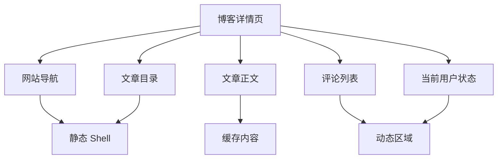
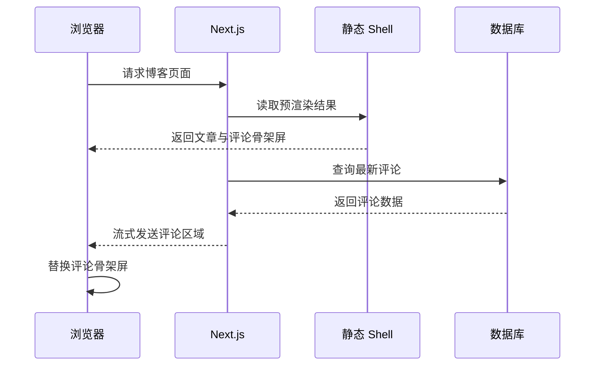
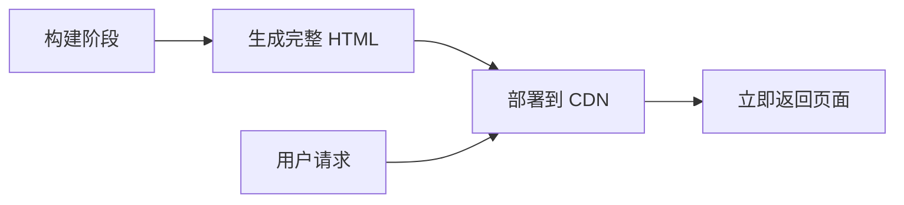
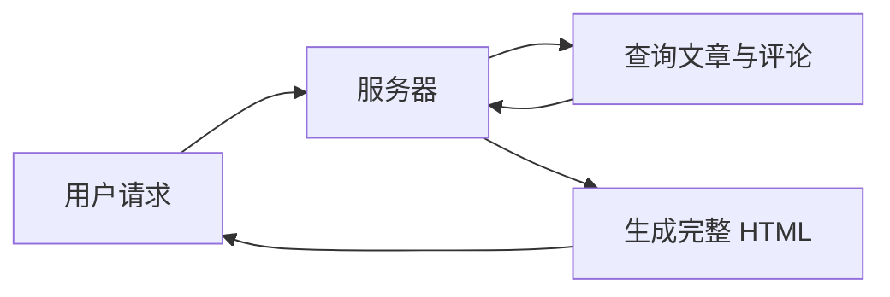
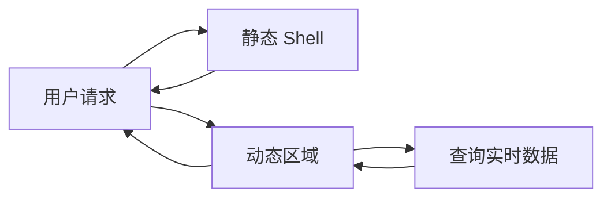
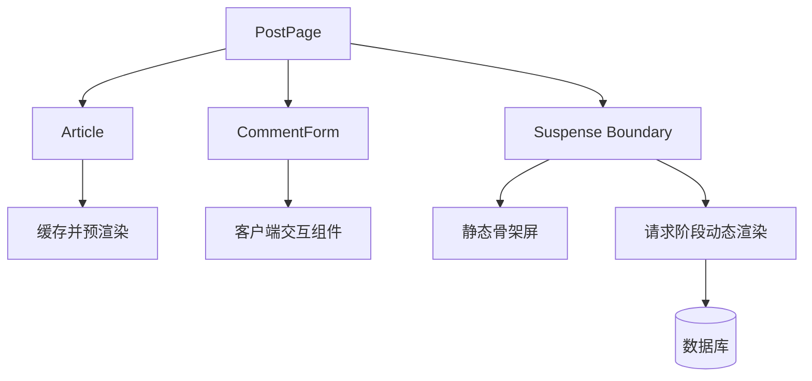
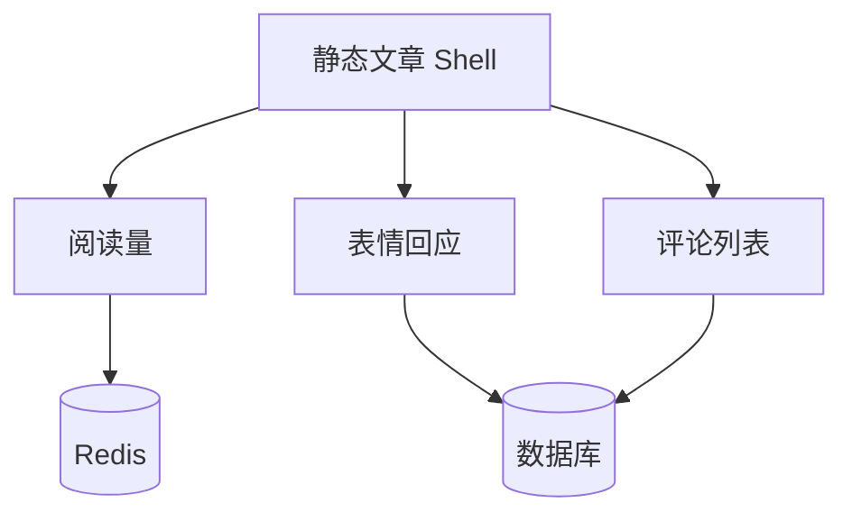
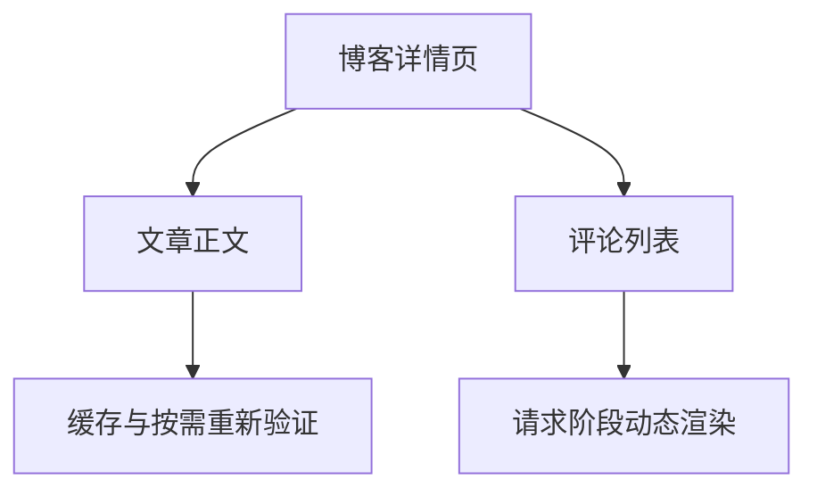
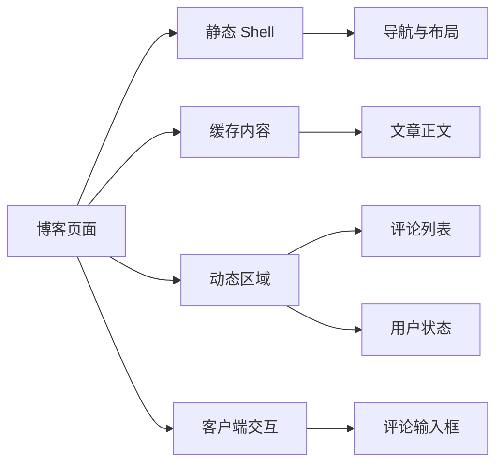

# 探秘 Next.js PPR：让静态博客拥有动态评论

## 前言

在开发博客时，我们经常会遇到一个看似矛盾的问题。

博客文章通常不会频繁变化，因此非常适合静态生成。静态页面可以直接从 CDN 返回，拥有更快的响应速度、更低的服务器开销以及更好的搜索引擎优化效果。

但博客页面又不完全是静态的。

例如：

- 评论需要显示最新数据
- 当前用户的登录状态因人而异
- 点赞状态需要根据当前用户计算
- 评论数量会不断发生变化
- 评论提交后应该立即出现在页面中

如果使用纯静态生成，那么评论可能无法及时更新。

如果将整个文章页面改成动态渲染，那么每次访问都需要重新查询文章、解析 Markdown、生成目录并渲染页面。明明只有评论发生变化，却要让整个页面承担动态渲染的成本。

传统的渲染模式似乎要求我们二选一：

> 要么选择快速但可能过期的静态页面，要么选择实时但成本更高的动态页面。

而 PPR，也就是部分预渲染（Partial Prerendering），正是为了打破这种二选一而设计的。

它允许我们在同一个页面中同时使用：

- 静态内容
- 缓存内容
- 动态内容

对于博客而言，我们可以提前生成文章主体，在用户请求页面时立即返回；评论区域则在请求阶段查询数据库，并通过流式渲染填充到页面中。

最终效果是：

> **文章像静态网站一样快速，评论像动态应用一样实时。**

## 什么是 PPR

PPR 的全称是 Partial Prerendering，中文通常翻译为**部分预渲染**。

它是一种将静态预渲染与动态服务端渲染组合在同一个路由中的渲染模式。

在传统的 Next.js 页面中，一个路由通常会被归类为：

- 静态路由
- 动态路由

只要页面中的某个组件读取了请求数据或者未缓存的数据，整个页面就可能需要在请求阶段动态渲染。

PPR 改变了这种以页面为单位的划分方式。

在 PPR 模式下，Next.js 会尝试在构建阶段预渲染组件树。能够提前确定的部分会被写入静态 HTML，而依赖请求或实时数据的部分会成为页面中的动态区域。

例如，一个博客详情页可以被拆分成下面几个部分：



其中：


| 页面区域 | 渲染方式 | 原因 |
| ----------- | ----- | -------------- |
| 网站导航 | 静态预渲染 | 所有用户看到的内容相同 |
| 文章标题 | 静态或缓存 | 文章不会频繁变化 |
| Markdown 正文 | 静态或缓存 | 内容更新频率较低 |
| 文章目录 | 静态预渲染 | 可以根据文章提前计算 |
| 评论列表 | 动态渲染 | 评论可能随时增加 |
| 登录状态 | 动态渲染 | 依赖当前请求的 Cookie |
| 评论输入框 | 客户端交互 | 需要状态和事件处理 |


PPR 最重要的思想是：

> **静态和动态不再是页面级别的选择，而是组件级别的组合。**

## PPR 是如何工作的

开启 PPR 后，Next.js 会在构建阶段分析页面的组件树。

对于不依赖网络数据、请求信息或者其他运行时数据的组件，Next.js 可以直接完成预渲染，并将结果加入静态 Shell。

对于无法在构建阶段完成的组件，我们需要明确告诉 Next.js 如何处理：

1. 使用 `use cache` 缓存结果，使其能够加入静态 Shell
2. 使用 `<Suspense>` 将其作为动态区域，推迟到请求阶段渲染

假设博客页面包含文章和评论：

```tsx
export default function PostPage() {
  return (
    <main>
      <Article />
      <Comments />
    </main>
  )
}

```

如果 `Comments` 会实时查询数据库，那么它无法在构建阶段稳定地完成预渲染。

我们可以使用 `Suspense` 将评论区域隔离：

```tsx
import { Suspense } from 'react'

export default function PostPage() {
  return (
    <main>
      <Article />

      <Suspense fallback={<CommentsSkeleton />}>
        <Comments />
      </Suspense>
    </main>
  )
}

```

这样，Next.js 就可以先生成文章部分的静态 HTML。

用户访问页面时，服务器可以立即返回：

```html
<main>
  <article>
    <!-- 已经预渲染完成的文章 -->
  </article>

  <section>
    <!-- 评论骨架屏 -->
  </section>
</main>

```

与此同时，服务器开始查询评论数据。

查询完成后，评论区域通过流式响应继续发送到浏览器，并替换原来的骨架屏。

整个过程可以表示为：



用户不需要等待评论查询完成，就能先看到文章主体。

这就是 PPR 带来的核心体验：

> **让慢数据不再阻塞快内容。**

## PPR、SSR 和 SSG 的区别

理解 PPR 最简单的方法，是将它与传统的 SSG 和 SSR 进行比较。

### SSG：整个页面提前生成

静态站点生成会在构建阶段完成整个页面的渲染。



它的优点是访问速度非常快。

但对于评论这样的实时数据来说，静态页面中的内容可能无法及时更新。

### SSR：整个页面请求时生成

服务端渲染会在用户访问页面时查询数据并生成 HTML。



它能够保证数据新鲜，但用户必须等待整个页面完成渲染。

即使文章内容没有变化，也需要重新读取并渲染。

### PPR：静态 Shell 加动态区域

PPR 将两种模式组合起来：



文章主体立即返回，评论稍后通过流式渲染补充。

三者可以总结为：


| 渲染模式 | 文章内容 | 评论内容 | 首屏速度 | 数据实时性 |
| ---- | ----- | ----- | -------- | ----- |
| SSG | 构建时生成 | 构建时生成 | 快 | 较低 |
| SSR | 请求时生成 | 请求时生成 | 取决于最慢的数据 | 高 |
| PPR | 提前生成 | 请求时生成 | 快 | 高 |


PPR 并不是一种完全独立的新渲染方式。

它更像是一种组合策略：

> **使用静态预渲染构建页面骨架，使用流式服务端渲染填充动态区域。**

## 在 Next.js 中开启 PPR

在 Next.js 16 中，PPR 被整合进了 Cache Components。

我们需要在 `next.config.ts` 中开启 `cacheComponents`：

```typescript
import type { NextConfig } from 'next'

const nextConfig: NextConfig = {
  cacheComponents: true,
}

export default nextConfig

```

开启之后，我们不再需要单独配置：

```typescript
experimental: {
  ppr: true,
}

```

`cacheComponents` 会统一启用与下面这些能力相关的渲染模型：

- Partial Prerendering
- `use cache`
- `cacheLife`
- `cacheTag`
- 显式缓存控制
- 动态区域流式渲染

需要注意的是，在 Cache Components 模式下，未缓存的数据访问默认发生在请求阶段。

如果某个组件读取了未缓存数据，我们应该：

- 使用 `<Suspense>` 包裹它，将其声明为动态区域
- 或者使用 `use cache` 缓存它，让它参与预渲染

否则，开发或构建时可能会遇到类似错误：

```text
Uncached data was accessed outside of <Suspense>

```

这个错误并不是在阻止我们使用动态数据。

它是在要求我们明确表达自己的渲染意图：

> 这部分数据究竟应该被缓存，还是应该在请求阶段加载？

## 实际应用：博客文章与评论系统

接下来，我们实现一个支持 PPR 的博客详情页。

目标是：

- 文章正文提前生成并缓存
- 评论列表在请求阶段动态查询
- 评论加载时显示骨架屏
- 用户可以通过 Server Action 提交评论
- 提交成功后刷新评论区域

项目结构如下：

```text
app/
└── posts/
    └── [slug]/
        ├── actions.ts
        ├── page.tsx
        └── components/
            ├── article.tsx
            ├── comment-form.tsx
            ├── comment-list.tsx
            └── comment-skeleton.tsx

server/
├── queries/
│   ├── comment.query.ts
│   └── post.query.ts
└── db.ts

```

## 第一步：缓存文章数据

文章内容不会频繁变化，因此非常适合缓存。

我们可以为文章查询添加 `use cache`：

```typescript
// server/queries/post.query.ts

import { cacheLife, cacheTag } from 'next/cache'

import { db } from '@/server/db'

export async function findPostBySlug(slug: string) {
  'use cache'

  cacheLife('weeks')
  cacheTag(`post:${slug}`)

  return db.query.posts.findFirst({
    where: (posts, { eq }) => eq(posts.slug, slug),
  })
}

```

这里做了三件事情。

### `use cache`

`use cache` 表示这个函数的返回结果可以被缓存。

函数参数会参与缓存键的生成，因此：

```typescript
findPostBySlug('nextjs-ppr')

```

和：

```typescript
findPostBySlug('react-server-components')

```

会生成不同的缓存条目。

### `cacheLife('weeks')`

`cacheLife` 用于声明缓存生命周期。

博客文章通常不会频繁修改，因此可以使用较长的缓存时间。

```typescript
cacheLife('weeks')

```

这并不意味着文章修改后必须等待一周才能更新。

我们仍然可以通过缓存标签主动让指定文章失效。

### `cacheTag`

下面这段代码为文章缓存添加了标签：

```typescript
cacheTag(`post:${slug}`)

```

当 CMS、GitHub Webhook 或后台管理系统更新文章后，可以精准地重新验证这篇文章：

```typescript
revalidateTag(`post:${slug}`, 'max')

```

这样不会误伤其他文章的缓存。

## 第二步：创建文章组件

文章组件调用已经缓存的数据查询：

```tsx
// app/posts/[slug]/components/article.tsx

import { notFound } from 'next/navigation'

import { findPostBySlug } from '@/server/queries/post.query'

interface ArticleProps {
  slug: string
}

export async function Article({ slug }: ArticleProps) {
  const post = await findPostBySlug(slug)

  if (!post) {
    notFound()
  }

  return (
    <article>
      <header>
        <h1>{post.title}</h1>
        <p>{post.description}</p>

        <time dateTime={post.createdAt.toISOString()}>
          {post.createdAt.toLocaleDateString('zh-CN')}
        </time>
      </header>

      <div>{post.content}</div>
    </article>
  )
}

```

因为 `findPostBySlug` 使用了 `use cache`，文章组件可以在预渲染阶段获得数据，并成为静态 Shell 的一部分。

真实项目中，`post.content` 可能是：

- Markdown
- MDX
- Tiptap JSON
- 已经生成的 HTML
- 来自 CMS 的富文本结构

无论文章正文采用什么格式，只要文章查询处于缓存作用域中，它就可以参与预渲染。

## 第三步：动态查询评论

评论和文章不同。

评论随时可能发生变化，用户通常希望看到最新结果。

因此，在最强调实时性的方案中，我们不为评论查询添加 `use cache`：

```typescript
// server/queries/comment.query.ts

import { db } from '@/server/db'

export async function findCommentsByPostId(postId: string) {
  return db.query.comments.findMany({
    where: (comments, { eq }) => eq(comments.postId, postId),
    orderBy: (comments, { desc }) => [desc(comments.createdAt)],
    with: {
      user: true,
    },
  })
}

```

这是一个未缓存的数据库查询。

在 Cache Components 模式下，它会被视为请求阶段的数据访问。

然后创建评论列表组件：

```tsx
// app/posts/[slug]/components/comment-list.tsx

import { findCommentsByPostId } from '@/server/queries/comment.query'

interface CommentListProps {
  postId: string
}

export async function CommentList({ postId }: CommentListProps) {
  const comments = await findCommentsByPostId(postId)

  if (comments.length === 0) {
    return (
      <div>
        <h2>评论</h2>
        <p>暂时还没有评论，来发表第一条评论吧。</p>
      </div>
    )
  }

  return (
    <section>
      <h2>评论（{comments.length}）</h2>

      <ul>
        {comments.map((comment) => (
          <li key={comment.id}>
            <header>
              <strong>{comment.user.name}</strong>
              <time dateTime={comment.createdAt.toISOString()}>
                {comment.createdAt.toLocaleString('zh-CN')}
              </time>
            </header>

            <p>{comment.content}</p>
          </li>
        ))}
      </ul>
    </section>
  )
}

```

由于这个组件会访问未缓存的数据，所以它不能直接放在页面的预渲染区域中。

我们需要使用 `Suspense` 为它创建一个动态边界。

## 第四步：创建评论骨架屏

动态评论加载期间，页面需要显示一个有意义的占位内容：

```tsx
// app/posts/[slug]/components/comment-skeleton.tsx

export function CommentSkeleton() {
  return (
    <section aria-busy="true" aria-label="正在加载评论">
      <h2>评论</h2>

      <div className="space-y-4">
        {Array.from({ length: 3 }).map((_, index) => (
          <div key={index} className="space-y-2">
            <div className="h-4 w-32 animate-pulse rounded bg-muted" />
            <div className="h-4 w-full animate-pulse rounded bg-muted" />
            <div className="h-4 w-2/3 animate-pulse rounded bg-muted" />
          </div>
        ))}
      </div>
    </section>
  )
}

```

骨架屏本身不依赖动态数据，因此可以直接加入静态 Shell。

这意味着用户收到的初始 HTML 中已经包含：

- 网站导航
- 文章标题
- 文章正文
- 文章目录
- 评论区域的骨架屏

只有真正的评论列表需要等待数据库查询。

## 第五步：组合静态文章与动态评论

现在可以在页面中组合这些组件：

```tsx
// app/posts/[slug]/page.tsx

import { Suspense } from 'react'
import { notFound } from 'next/navigation'

import { findPostBySlug } from '@/server/queries/post.query'

import { Article } from './components/article'
import { CommentForm } from './components/comment-form'
import { CommentList } from './components/comment-list'
import { CommentSkeleton } from './components/comment-skeleton'

interface PostPageProps {
  params: Promise<{
    slug: string
  }>
}

export default async function PostPage({ params }: PostPageProps) {
  const { slug } = await params
  const post = await findPostBySlug(slug)

  if (!post) {
    notFound()
  }

  return (
    <main>
      <Article slug={slug} />

      <hr />

      <CommentForm postId={post.id} />

      <Suspense fallback={<CommentSkeleton />}>
        <CommentList postId={post.id} />
      </Suspense>
    </main>
  )
}

```

这里最关键的是：

```tsx
<Suspense fallback={<CommentSkeleton />}>
  <CommentList postId={post.id} />
</Suspense>

```

这段代码实际上是在告诉 Next.js：

> 评论列表不需要阻塞整个页面。先生成页面的其他部分，在收到请求之后再查询评论，并将结果流式发送给浏览器。

最终，这个页面形成了下面的渲染结构：



## 第六步：实现评论提交

评论表单需要处理输入状态和用户交互，因此适合使用 Client Component。

首先创建 Server Action：

```typescript
// app/posts/[slug]/actions.ts

'use server'

import { revalidatePath } from 'next/cache'

import { auth } from '@/lib/auth'
import { db } from '@/server/db'

export async function createComment(formData: FormData) {
  const postId = formData.get('postId')
  const content = formData.get('content')

  if (typeof postId !== 'string' || typeof content !== 'string') {
    throw new Error('评论参数不正确')
  }

  const normalizedContent = content.trim()

  if (!normalizedContent) {
    throw new Error('评论内容不能为空')
  }

  if (normalizedContent.length > 1000) {
    throw new Error('评论内容不能超过 1000 个字符')
  }

  const session = await auth.api.getSession({
    headers: await import('next/headers').then(({ headers }) => headers()),
  })

  if (!session) {
    throw new Error('请先登录后再发表评论')
  }

  await db.insert(comments).values({
    postId,
    userId: session.user.id,
    content: normalizedContent,
  })

  revalidatePath(`/posts/${postId}`)
}

```

然后创建评论表单：

```tsx
// app/posts/[slug]/components/comment-form.tsx

'use client'

import { useActionState } from 'react'

import { createComment } from '../actions'

interface CommentFormProps {
  postId: string
}

export function CommentForm({ postId }: CommentFormProps) {
  const [state, action, pending] = useActionState(
    async (_state: { error?: string }, formData: FormData) => {
      try {
        await createComment(formData)
        return {}
      } catch (error) {
        return {
          error: error instanceof Error ? error.message : '评论提交失败',
        }
      }
    },
    {},
  )

  return (
    <form action={action}>
      <input type="hidden" name="postId" value={postId} />

      <label htmlFor="comment-content">发表评论</label>

      <textarea
        id="comment-content"
        name="content"
        maxLength={1000}
        placeholder="写下你的评论……"
        required
      />

      {state.error ? (
        <p role="alert">{state.error}</p>
      ) : null}

      <button type="submit" disabled={pending}>
        {pending ? '正在提交……' : '发表评论'}
      </button>
    </form>
  )
}

```

评论写入数据库后，页面会重新获取动态区域的数据，从而显示最新评论。

不过，上面的示例使用 `postId` 生成页面路径并不一定符合真实项目的路由设计。如果你的页面路径使用 `slug`，更合理的方式是同时将 `slug` 传给 Server Action：

```tsx
<input type="hidden" name="slug" value={slug} />

```

然后执行：

```typescript
revalidatePath(`/posts/${slug}`)

```

## 评论一定不能缓存吗

并不是。

评论是否缓存，需要根据产品需求决定。

### 方案一：完全动态评论

```typescript
export async function findCommentsByPostId(postId: string) {
  return db.query.comments.findMany({
    where: (comments, { eq }) => eq(comments.postId, postId),
  })
}

```

优点：

- 每次请求都能获得最新数据
- 实现方式直观
- 不需要处理评论缓存失效

缺点：

- 每次访问都要查询数据库
- 高流量文章可能给数据库带来压力
- 评论查询速度会影响动态区域出现的时间

这种方案适合：

- 评论量较少的个人博客
- 强调实时性的社区
- 访问量不高的项目
- 已经有数据库连接池或查询缓存的系统

### 方案二：短时间缓存评论

如果博客流量较大，可以为评论添加短期缓存：

```typescript
// server/queries/comment.query.ts

import { cacheLife, cacheTag } from 'next/cache'

import { db } from '@/server/db'

export async function findCommentsByPostId(postId: string) {
  'use cache'

  cacheLife('minutes')
  cacheTag(`comments:${postId}`)

  return db.query.comments.findMany({
    where: (comments, { eq }) => eq(comments.postId, postId),
    orderBy: (comments, { desc }) => [desc(comments.createdAt)],
    with: {
      user: true,
    },
  })
}

```

评论提交后，通过 `updateTag` 让缓存立即失效：

```typescript
'use server'

import { updateTag } from 'next/cache'

export async function createComment(formData: FormData) {
  const postId = String(formData.get('postId'))
  const content = String(formData.get('content')).trim()

  await db.insert(comments).values({
    postId,
    content,
    userId: 'current-user-id',
  })

  updateTag(`comments:${postId}`)
}

```

`updateTag` 适合评论提交这样的场景，因为用户完成写操作后，通常希望立即看到自己刚刚发布的内容。

它提供的是“读取自己的写入”语义：

> 用户提交评论后，下一次读取会等待新数据，而不是继续返回旧缓存。

### 方案三：后台重新验证评论

如果评论是通过 Route Handler、Webhook 或后台审核系统更新的，可以使用：

```typescript
revalidateTag(`comments:${postId}`, 'max')

```

它会将缓存标记为过期，并采用 stale-while-revalidate 行为。

也就是说：

1. 用户可以先获得旧评论
2. Next.js 在后台重新查询评论
3. 后续请求获得新的评论数据

这种方式响应速度更稳定，但刚刚提交的评论可能不会立即出现。

因此可以这样选择：


| 场景 | 推荐方式 |
| ----------- | ------------------------------- |
| 评论必须绝对实时 | 不缓存评论 |
| 用户提交后必须立即看到 | `updateTag` |
| 可以短暂显示旧数据 | `revalidateTag(tag, 'max')` |
| 评论更新频率较低 | `use cache` + `cacheLife` |
| 后台审核通过后刷新 | Route Handler + `revalidateTag` |


## PPR 不等于客户端请求

看到动态区域之后，有些人可能会认为：

> 这不就是先生成文章，然后在浏览器里通过 `useEffect` 请求评论吗？

两者看起来相似，但实现方式完全不同。

客户端请求通常是：

```tsx
'use client'

export function Comments() {
  const [comments, setComments] = useState([])

  useEffect(() => {
    fetch('/api/comments')
      .then((response) => response.json())
      .then(setComments)
  }, [])

  return <CommentList comments={comments} />
}

```

这种方式需要经历：

1. 下载页面 HTML
2. 下载 JavaScript
3. 执行 React 水合
4. 执行 `useEffect`
5. 请求评论接口
6. 客户端渲染评论

而 PPR 中的动态评论仍然可以是 Server Component：

```tsx
export async function CommentList({ postId }: CommentListProps) {
  const comments = await findCommentsByPostId(postId)

  return <CommentItems comments={comments} />
}

```

它不需要为了查询评论而向浏览器发送额外的业务 JavaScript。

评论 HTML 由服务器生成，并通过 React Server Components 的流式响应发送到浏览器。

两种方式的区别可以总结为：


| 特性 | 客户端请求 | PPR 动态区域 |
| ------------------ | ------ | --------- |
| 数据查询位置 | 浏览器 | 服务器 |
| 是否需要额外 API | 通常需要 | 不一定需要 |
| 是否增加客户端 JavaScript | 是 | 查询逻辑不会 |
| 是否能直接访问数据库 | 否 | 可以 |
| 是否支持流式 HTML | 通常不支持 | 支持 |
| 是否需要等待水合后请求 | 是 | 否 |
| 敏感数据是否暴露给客户端 | 需要谨慎处理 | 查询代码只在服务端 |


PPR 并不是把动态内容推给客户端处理。

它做的是：

> **让服务器可以分阶段返回页面。**

## PPR 和 Suspense 的关系

PPR 并不是单独完成动态渲染的。

它依赖 React Suspense 来划分静态区域和动态区域。

```tsx
<Suspense fallback={<CommentSkeleton />}>
  <CommentList postId={postId} />
</Suspense>

```

这里的 `Suspense` 同时承担了两个职责。

### 第一层职责：定义加载状态

当评论还没有准备好时，展示：

```tsx
<CommentSkeleton />

```

### 第二层职责：定义渲染边界

它告诉 Next.js：

```text
这个子树可以晚一点完成，不需要阻塞页面的其他部分。

```

因此，设计 PPR 页面时，Suspense 边界的位置非常重要。

如果边界过大：

```tsx
<Suspense fallback={<PageSkeleton />}>
  <Article />
  <Comments />
</Suspense>

```

评论查询可能会导致文章也只能显示骨架屏。

如果边界足够精细：

```tsx
<Article />

<Suspense fallback={<CommentSkeleton />}>
  <Comments />
</Suspense>

```

文章可以立即出现，只有评论区域需要等待。

这体现了一个重要原则：

> **Suspense 应该尽量靠近真正的动态数据。**

## 一个页面可以有多个动态区域

PPR 页面不只能有一个动态区域。

博客详情页可能同时包含：

- 评论列表
- 用户登录状态
- 当前用户是否点赞
- 阅读量
- 推荐文章
- 个性化广告

我们可以分别为它们创建 Suspense 边界：

```tsx
export default async function PostPage({ params }: PostPageProps) {
  const { slug } = await params

  return (
    <main>
      <Article slug={slug} />

      <Suspense fallback={<ViewCountSkeleton />}>
        <ViewCount slug={slug} />
      </Suspense>

      <Suspense fallback={<ReactionSkeleton />}>
        <ReactionPanel slug={slug} />
      </Suspense>

      <Suspense fallback={<CommentSkeleton />}>
        <CommentList slug={slug} />
      </Suspense>
    </main>
  )
}

```

这些动态区域可以独立加载。



如果阅读量查询很快，它可以先显示。

即使评论查询较慢，也不会阻塞阅读量和表情回应。

这不仅提升了首屏速度，也避免了不同数据源之间相互拖累。

## PPR 会自动提升性能吗

PPR 提供了一套更灵活的渲染机制，但并不意味着开启之后页面就一定更快。

性能仍然取决于我们如何划分组件。

### 不要在页面顶部读取动态数据

下面的代码会让整个页面等待评论查询：

```tsx
export default async function PostPage({ params }: PostPageProps) {
  const { slug } = await params
  const comments = await findCommentsBySlug(slug)

  return (
    <main>
      <Article slug={slug} />
      <CommentList comments={comments} />
    </main>
  )
}

```

虽然 `CommentList` 看起来是独立组件，但数据已经在页面顶部被 `await`。

更好的方式是让动态组件自己读取数据：

```tsx
export default async function PostPage({ params }: PostPageProps) {
  const { slug } = await params

  return (
    <main>
      <Article slug={slug} />

      <Suspense fallback={<CommentSkeleton />}>
        <CommentList slug={slug} />
      </Suspense>
    </main>
  )
}

```

然后在 `CommentList` 内部查询：

```tsx
export async function CommentList({ slug }: { slug: string }) {
  const comments = await findCommentsBySlug(slug)

  return <CommentItems comments={comments} />
}

```

### 不要创建一个巨大的 Suspense 边界

下面的写法会让所有动态区域共用一个加载状态：

```tsx
<Suspense fallback={<PageSkeleton />}>
  <ViewCount />
  <ReactionPanel />
  <CommentList />
</Suspense>

```

只要其中一个组件较慢，整个区域都无法显示。

更合理的方式是分别创建边界：

```tsx
<Suspense fallback={<ViewCountSkeleton />}>
  <ViewCount />
</Suspense>

<Suspense fallback={<ReactionSkeleton />}>
  <ReactionPanel />
</Suspense>

<Suspense fallback={<CommentSkeleton />}>
  <CommentList />
</Suspense>

```

### 不要缓存所有东西

`use cache` 并不是越多越好。

下面这些内容通常不应该放入公共缓存：

- 当前用户的登录状态
- 当前用户是否点赞
- 当前用户的通知数量
- 根据 Cookie 生成的个性化内容
- 权限相关数据
- 必须绝对实时的数据

缓存之前应该先问自己：

> 不同用户是否可以安全地获得同一份结果？

如果答案是否定的，就不应该直接使用公共 `use cache`。

## PPR 与 ISR 有什么区别

PPR 和 ISR 经常同时出现，但它们解决的不是同一个问题。

ISR 的核心问题是：

> 已经生成的缓存内容应该在什么时候更新？

PPR 的核心问题是：

> 一个页面中的哪些部分应该提前生成，哪些部分应该在请求时生成？

例如，在博客页面中：



文章正文可以使用：

```typescript
'use cache'
cacheLife('weeks')
cacheTag(`post:${slug}`)

```

这部分主要体现缓存和重新验证机制。

评论组件使用：

```tsx
<Suspense fallback={<CommentSkeleton />}>
  <CommentList postId={postId} />
</Suspense>

```

这部分主要体现 PPR 的动态区域。

因此，一个页面完全可以同时使用 PPR 和类似 ISR 的缓存更新策略。

两者的关系可以总结为：


| 技术 | 解决的问题 |
| --------------- | --------------- |
| PPR | 一个页面如何组合静态与动态区域 |
| `use cache` | 哪些函数或组件结果应该缓存 |
| `cacheLife` | 缓存可以使用多久 |
| `cacheTag` | 如何标记缓存 |
| `revalidateTag` | 如何让缓存进入后台重新验证 |
| `updateTag` | 如何让用户立即看到自己的写入 |
| Suspense | 哪些组件可以延迟并流式渲染 |


PPR 关注的是页面结构。

ISR 和 Cache Components 的重新验证机制关注的是数据生命周期。

## PPR 最适合哪些场景

PPR 最适合页面主体相对稳定，但局部区域需要动态数据的场景。

### 博客文章

静态部分：

- 标题
- 正文
- 封面
- 标签
- 文章目录

动态部分：

- 评论
- 阅读量
- 点赞状态
- 当前用户信息

### 电商商品页

静态或缓存部分：

- 商品名称
- 商品描述
- 商品图片

动态部分：

- 实时库存
- 用户购物车
- 个性化推荐
- 当前价格

### 文档网站

静态部分：

- 文档正文
- 代码示例
- 页面导航

动态部分：

- 用户登录状态
- 搜索建议
- 反馈组件
- 个性化历史记录

### 社区帖子

静态或缓存部分：

- 帖子正文
- 作者公开信息

动态部分：

- 回复列表
- 点赞状态
- 在线状态
- 审核结果

它们都有同一个特点：

> 页面的大部分内容可以提前生成，只有少部分内容必须在请求阶段确定。

## PPR 不适合哪些场景

如果页面几乎所有内容都依赖当前用户，那么 PPR 带来的收益可能有限。

例如：

- 私人管理后台
- 在线聊天页面
- 实时监控面板
- 高度个性化的信息流
- 每个用户内容都完全不同的工作台

这些页面几乎不存在可复用的静态 Shell。

此时，与其强行拆分静态区域，不如直接使用动态 Server Components、客户端数据请求或者专门的实时通信方案。

PPR 不是为了消灭动态渲染。

它解决的是：

> 不要因为页面中存在一小块动态内容，就放弃其余内容的预渲染能力。

## 总结

传统的渲染模式习惯以页面为单位思考：

- 这个页面是静态页面
- 这个页面是动态页面

PPR 则要求我们以组件树为单位思考：

- 哪些组件可以提前渲染
- 哪些数据适合缓存
- 哪些组件依赖请求信息
- 哪些区域必须读取实时数据
- 哪些动态区域可以独立加载

以博客评论系统为例，我们可以将页面拆分为：



文章正文使用 `use cache`、`cacheLife` 和 `cacheTag`，获得接近静态页面的访问性能。

评论列表放入 Suspense 边界，在请求阶段查询数据库，并通过流式渲染发送给浏览器。

评论表单使用 Client Component 提供交互，通过 Server Action 写入数据库。

评论提交后，再根据一致性要求选择：

- 完全不缓存
- `updateTag`
- `revalidateTag(tag, 'max')`

最终，我们不再需要为了几条实时评论，将整篇文章变成动态页面。

这正是 PPR 最有价值的地方：

> **它保留了静态页面的速度，同时赋予局部区域动态应用的能力。**

PPR 并不是简单地把一个页面切成“静态一半”和“动态一半”。

它真正带来的是一种新的页面设计思维：

> **缓存应该是局部的，动态也应该是局部的。**

当静态、缓存、动态和客户端交互可以在同一个组件树中自由组合时，Next.js 页面不再需要在 SSG 和 SSR 之间做出非黑即白的选择。

文章可以保持稳定与快速，评论可以保持实时与鲜活。

这或许就是部分预渲染最准确的定义：

> **只在真正需要动态的地方动态渲染。**

